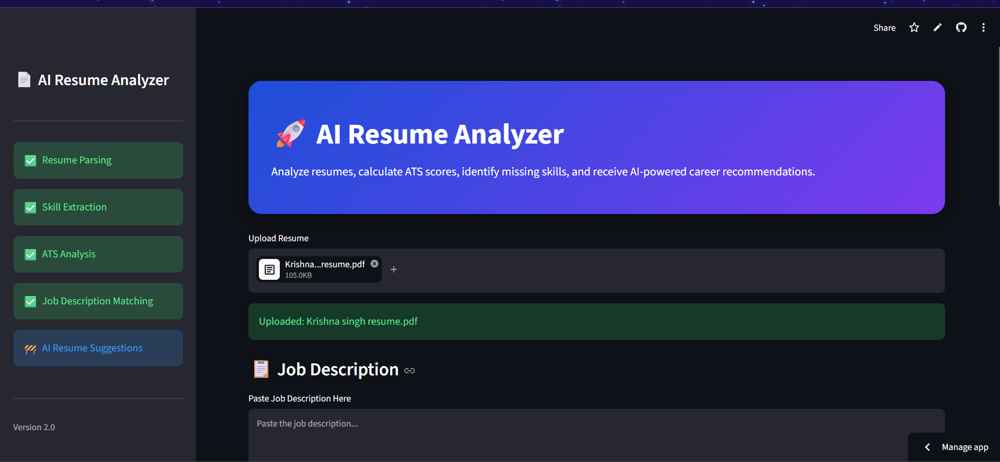
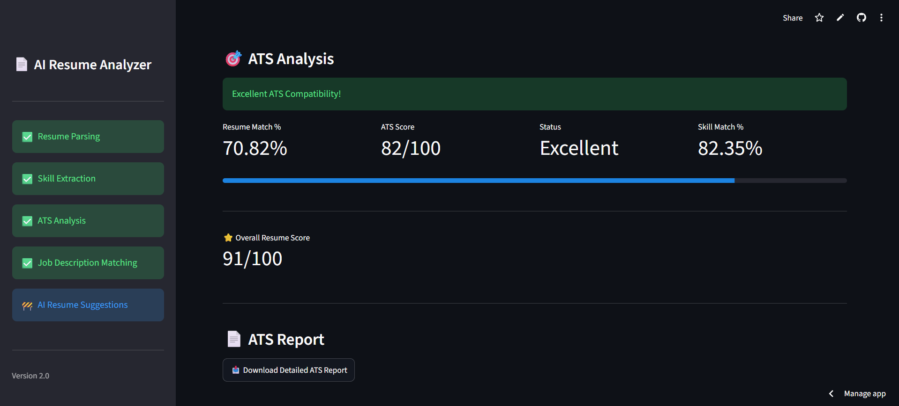
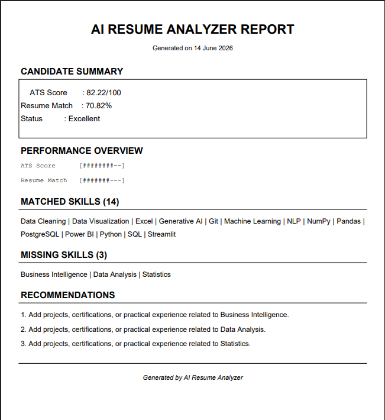

# AI Resume Analyzer

An AI-powered Resume Analyzer that evaluates ATS compatibility, matches resumes against job descriptions, identifies skill gaps, and generates personalized improvement suggestions using Google Gemini AI.

## Features

* Resume Parsing from PDF files
* ATS Score Calculation
* Resume vs Job Description Match Score
* Skill Extraction using NLP
* Missing Skill Detection
* AI-Powered Resume Recommendations (Gemini AI)
* Interactive Dashboard with Visual Analytics
* Professional PDF Report Generation
* Streamlit Cloud Deployment

## Demo

Upload your resume and a job description to receive:

* ATS Compatibility Score
* Resume Match Percentage
* Matched Skills
* Missing Skills
* AI Suggestions for Improvement
* Downloadable Detailed Report

## Tech Stack

### Frontend

* Streamlit
* Plotly

### Backend

* Python

### AI & NLP

* Google Gemini AI
* Sentence Transformers
* Scikit-learn

### Data Processing

* Pandas
* NumPy

### PDF Processing

* PyPDF2
* pdfplumber
* FPDF

## Project Architecture

```text
Resume PDF
     |
     v
Resume Parser
     |
     v
Skill Extraction
     |
     +-------------------+
     |                   |
     v                   v
ATS Scoring       JD Analysis
     |                   |
     +---------+---------+
               |
               v
       Match Score Engine
               |
               v
      Gemini AI Suggestions
               |
               v
      PDF Report Generator
```

## Installation

### Clone Repository

```bash
git clone https://github.com/YOUR_USERNAME/ai-resume-analyzer.git
cd ai-resume-analyzer
```

### Create Virtual Environment

```bash
python -m venv venv
```

Activate:

```bash
venv\Scripts\activate
```

### Install Dependencies

```bash
pip install -r requirements.txt
```

### Configure Environment Variables

Create a `.env` file:

```env
GEMINI_API_KEY=YOUR_API_KEY
```

### Run Application

```bash
streamlit run app.py
```

## Screenshots

### Dashboard



### ATS Analysis



### PDF Report



## Sample Output

* ATS Score: 82.22/100
* Resume Match: 70.82%
* Missing Skills Identified
* Personalized AI Recommendations

## Future Improvements

* Multi-format Resume Support (DOCX)
* Industry-Specific ATS Models
* Resume Keyword Optimization
* Interview Preparation Assistant
* Resume Ranking System

## Author

Krishna Singh

LinkedIn: https://www.linkedin.com/in/krishna-singh-a54463285/

GitHub: https://github.com/krishna26005-debug

## License

This project is open-source and available under the MIT License.
